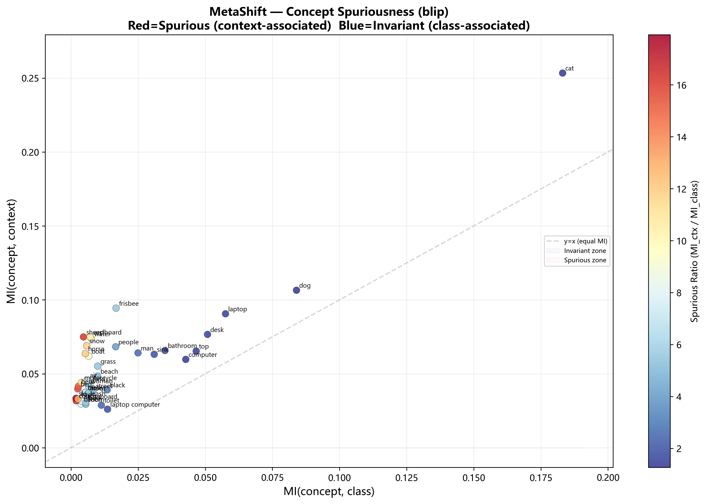
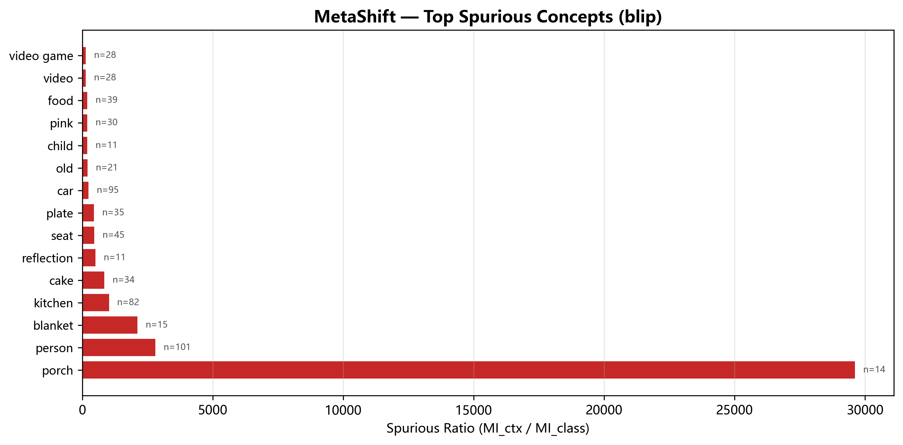

# MetaShift — Concept Quality Report: blip

## 1. Methodology

- **PMI(c, t)** = log P(c,t) / (P(c)·P(t))
- **MI(c; class)** = Σ P(c,cls) · PMI(c, cls)
- **MI(c; context)** = Σ P(c,ctx) · PMI(c, ctx)
- **Spurious Ratio** = MI(c; context) / (MI(c; class) + ε)

High spurious ratio → concept strongly associated with specific contexts (likely spurious).
Low spurious ratio → concept strongly associated with specific classes (invariant / diagnostic).

## 2. Top Spurious Concepts (High context association)

| Rank | Concept | MI Class | MI Context | Spurious Ratio | Frequency |
|------|---------|----------|------------|----------------|-----------|
| 1 | porch | 0.00000 | 0.00801 | 29634.2 | 14 |
| 2 | person | 0.00001 | 0.02177 | 2819.0 | 101 |
| 3 | blanket | 0.00000 | 0.00500 | 2127.3 | 15 |
| 4 | kitchen | 0.00003 | 0.03013 | 1037.1 | 82 |
| 5 | cake | 0.00002 | 0.02028 | 859.4 | 34 |
| 6 | reflection | 0.00001 | 0.00443 | 523.2 | 11 |
| 7 | seat | 0.00003 | 0.01281 | 474.0 | 45 |
| 8 | plate | 0.00003 | 0.01397 | 462.8 | 35 |
| 9 | car | 0.00007 | 0.01839 | 246.8 | 95 |
| 10 | old | 0.00005 | 0.00978 | 210.4 | 21 |
| 11 | child | 0.00003 | 0.00599 | 207.6 | 11 |
| 12 | pink | 0.00005 | 0.01124 | 207.0 | 30 |
| 13 | food | 0.00006 | 0.01282 | 204.0 | 39 |
| 14 | video | 0.00008 | 0.01175 | 149.2 | 28 |
| 15 | video game | 0.00008 | 0.01175 | 149.2 | 28 |
| 16 | glass | 0.00004 | 0.00565 | 143.6 | 14 |
| 17 | edge | 0.00007 | 0.00830 | 118.9 | 14 |
| 18 | bear | 0.00007 | 0.00801 | 114.9 | 23 |
| 19 | head | 0.00009 | 0.00967 | 106.0 | 44 |
| 20 | baseball | 0.00008 | 0.00859 | 104.2 | 24 |

## 3. Top Invariant Concepts (High class association)

| Rank | Concept | MI Class | MI Context | Frequency |
|------|---------|----------|------------|-----------|
| 1 | cat | 0.18309 | 0.25338 | 906 |
| 2 | dog | 0.08398 | 0.10651 | 3434 |
| 3 | laptop | 0.05753 | 0.09058 | 226 |
| 4 | desk | 0.05083 | 0.07664 | 192 |
| 5 | top | 0.04662 | 0.06537 | 260 |
| 6 | computer | 0.04274 | 0.05975 | 146 |
| 7 | bathroom | 0.03500 | 0.06576 | 115 |
| 8 | sink | 0.03099 | 0.06316 | 113 |
| 9 | man | 0.02494 | 0.06413 | 1296 |
| 10 | frisbee | 0.01678 | 0.09440 | 585 |
| 11 | people | 0.01663 | 0.06829 | 667 |
| 12 | laptop computer | 0.01361 | 0.02606 | 53 |
| 13 | black | 0.01345 | 0.03914 | 458 |
| 14 | toilet | 0.01131 | 0.02876 | 48 |
| 15 | keyboard | 0.01084 | 0.01970 | 40 |
| 16 | tv | 0.01004 | 0.02278 | 44 |
| 17 | grass | 0.00995 | 0.05517 | 347 |
| 18 | beach | 0.00989 | 0.04845 | 345 |
| 19 | street | 0.00823 | 0.03865 | 287 |
| 20 | monitor | 0.00821 | 0.01414 | 24 |

## 4. Potential Spurious Concepts for SPUME

These concepts are strongly associated with specific contexts but not with classes:

- **porch** (ratio=29634.2, freq=14)
- **person** (ratio=2819.0, freq=101)
- **blanket** (ratio=2127.3, freq=15)
- **kitchen** (ratio=1037.1, freq=82)
- **cake** (ratio=859.4, freq=34)
- **reflection** (ratio=523.2, freq=11)
- **seat** (ratio=474.0, freq=45)
- **plate** (ratio=462.8, freq=35)
- **car** (ratio=246.8, freq=95)
- **old** (ratio=210.4, freq=21)
- **child** (ratio=207.6, freq=11)
- **pink** (ratio=207.0, freq=30)
- **food** (ratio=204.0, freq=39)
- **video** (ratio=149.2, freq=28)
- **video game** (ratio=149.2, freq=28)

## 5. Diagnostic Concepts (use for classification)

- **cat** (MI_class=0.18309, MI_ctx=0.25338)
- **dog** (MI_class=0.08398, MI_ctx=0.10651)
- **top** (MI_class=0.04662, MI_ctx=0.06537)
- **computer** (MI_class=0.04274, MI_ctx=0.05975)
- **desk** (MI_class=0.05083, MI_ctx=0.07664)
- **laptop** (MI_class=0.05753, MI_ctx=0.09058)
- **bathroom** (MI_class=0.03500, MI_ctx=0.06576)
- **monitor** (MI_class=0.00821, MI_ctx=0.01414)
- **keyboard** (MI_class=0.01084, MI_ctx=0.01970)
- **laptop computer** (MI_class=0.01361, MI_ctx=0.02606)

## 6. Visualizations

