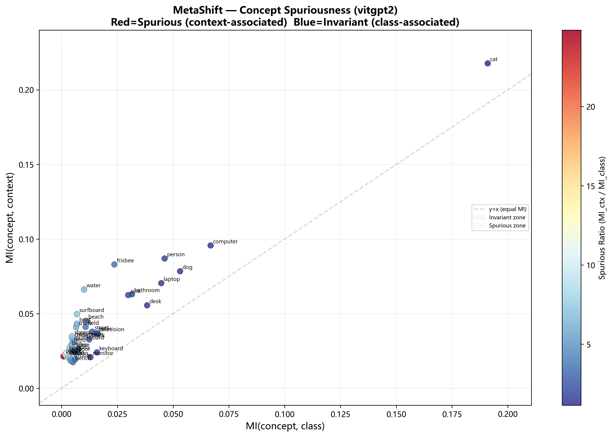
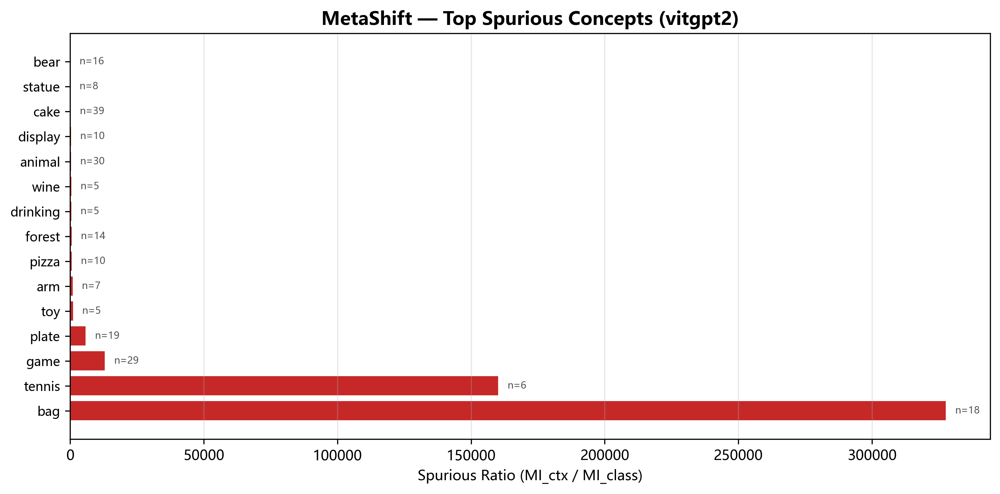

# MetaShift — Concept Quality Report: vitgpt2

## 1. Methodology

- **PMI(c, t)** = log P(c,t) / (P(c)·P(t))
- **MI(c; class)** = Σ P(c,cls) · PMI(c, cls)
- **MI(c; context)** = Σ P(c,ctx) · PMI(c, ctx)
- **Spurious Ratio** = MI(c; context) / (MI(c; class) + ε)

High spurious ratio → concept strongly associated with specific contexts (likely spurious).
Low spurious ratio → concept strongly associated with specific classes (invariant / diagnostic).

## 2. Top Spurious Concepts (High context association)

| Rank | Concept | MI Class | MI Context | Spurious Ratio | Frequency |
|------|---------|----------|------------|----------------|-----------|
| 1 | bag | 0.00000 | 0.00475 | 327769.3 | 18 |
| 2 | tennis | 0.00000 | 0.00184 | 160307.8 | 6 |
| 3 | game | 0.00000 | 0.00789 | 13114.8 | 29 |
| 4 | plate | 0.00000 | 0.00774 | 5944.4 | 19 |
| 5 | toy | 0.00000 | 0.00464 | 1179.3 | 5 |
| 6 | arm | 0.00000 | 0.00371 | 1109.9 | 7 |
| 7 | pizza | 0.00001 | 0.00558 | 710.2 | 10 |
| 8 | forest | 0.00001 | 0.00454 | 680.6 | 14 |
| 9 | drinking | 0.00000 | 0.00233 | 592.4 | 5 |
| 10 | wine | 0.00000 | 0.00223 | 567.1 | 5 |
| 11 | animal | 0.00002 | 0.01112 | 472.0 | 30 |
| 12 | display | 0.00001 | 0.00363 | 461.4 | 10 |
| 13 | cake | 0.00005 | 0.01535 | 314.0 | 39 |
| 14 | statue | 0.00001 | 0.00231 | 195.6 | 8 |
| 15 | bear | 0.00002 | 0.00452 | 191.1 | 16 |
| 16 | wood | 0.00002 | 0.00402 | 166.3 | 9 |
| 17 | rock | 0.00002 | 0.00320 | 132.5 | 9 |
| 18 | orange | 0.00002 | 0.00311 | 128.8 | 9 |
| 19 | basket | 0.00004 | 0.00428 | 108.4 | 10 |
| 20 | seat | 0.00009 | 0.00986 | 107.4 | 30 |

## 3. Top Invariant Concepts (High class association)

| Rank | Concept | MI Class | MI Context | Frequency |
|------|---------|----------|------------|-----------|
| 1 | cat | 0.19100 | 0.21775 | 771 |
| 2 | computer | 0.06680 | 0.09569 | 206 |
| 3 | dog | 0.05312 | 0.07842 | 2319 |
| 4 | person | 0.04619 | 0.08695 | 2163 |
| 5 | laptop | 0.04467 | 0.07041 | 151 |
| 6 | desk | 0.03833 | 0.05556 | 124 |
| 7 | bathroom | 0.03154 | 0.06298 | 98 |
| 8 | sink | 0.02986 | 0.06241 | 96 |
| 9 | frisbee | 0.02368 | 0.08296 | 605 |
| 10 | television | 0.01622 | 0.03671 | 92 |
| 11 | keyboard | 0.01584 | 0.02402 | 45 |
| 12 | toilet | 0.01550 | 0.03686 | 52 |
| 13 | street | 0.01373 | 0.03786 | 422 |
| 14 | monitor | 0.01295 | 0.02079 | 45 |
| 15 | black | 0.01239 | 0.03268 | 387 |
| 16 | beach | 0.01096 | 0.04521 | 280 |
| 17 | field | 0.01076 | 0.04107 | 275 |
| 18 | water | 0.01009 | 0.06616 | 416 |
| 19 | air | 0.00759 | 0.02653 | 194 |
| 20 | surfboard | 0.00690 | 0.04967 | 202 |

## 4. Potential Spurious Concepts for SPUME

These concepts are strongly associated with specific contexts but not with classes:

- **bag** (ratio=327769.3, freq=18)
- **game** (ratio=13114.8, freq=29)
- **plate** (ratio=5944.4, freq=19)
- **pizza** (ratio=710.2, freq=10)
- **forest** (ratio=680.6, freq=14)
- **animal** (ratio=472.0, freq=30)
- **display** (ratio=461.4, freq=10)
- **cake** (ratio=314.0, freq=39)
- **bear** (ratio=191.1, freq=16)
- **basket** (ratio=108.4, freq=10)
- **seat** (ratio=107.4, freq=30)
- **car** (ratio=92.3, freq=93)
- **fire** (ratio=72.1, freq=50)
- **sign** (ratio=63.1, freq=20)
- **video** (ratio=61.5, freq=20)

## 5. Diagnostic Concepts (use for classification)

- **cat** (MI_class=0.19100, MI_ctx=0.21775)
- **computer** (MI_class=0.06680, MI_ctx=0.09569)
- **dog** (MI_class=0.05312, MI_ctx=0.07842)
- **desk** (MI_class=0.03833, MI_ctx=0.05556)
- **laptop** (MI_class=0.04467, MI_ctx=0.07041)
- **keyboard** (MI_class=0.01584, MI_ctx=0.02402)
- **person** (MI_class=0.04619, MI_ctx=0.08695)
- **monitor** (MI_class=0.01295, MI_ctx=0.02079)
- **bathroom** (MI_class=0.03154, MI_ctx=0.06298)
- **mouse** (MI_class=0.00315, MI_ctx=0.00625)

## 6. Visualizations

