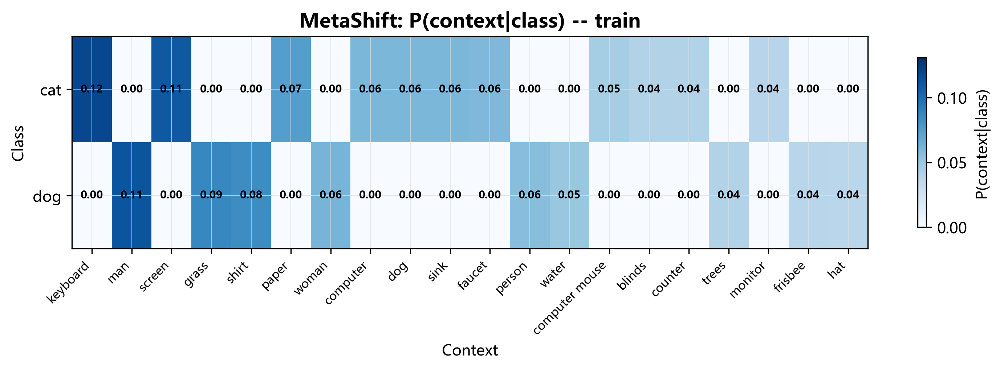
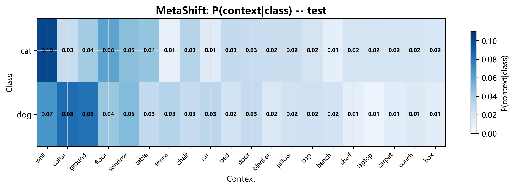
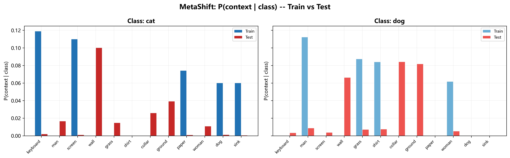
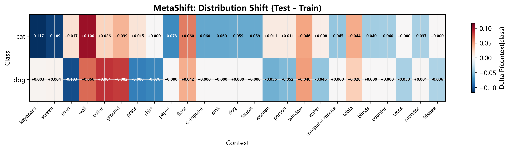

# MetaShift Cat vs Dog -- Class-Context Distribution Shift Analysis

## 1. Dataset Overview

MetaShift (Liang & Zou, ICLR 2022) constructed from Visual Genome images.
Each image is tagged with a (class, context) pair.

- **train**: 4,676 samples, 2 classes, 153 unique contexts
- **val**: 1,113 samples, 2 classes, 153 unique contexts
- **test**: 13,447 samples, 2 classes, 153 unique contexts

## 2. Is There a Genuine Spurious Correlation Shift?

- **Total variation distance (train<->test)**: 1.9068
- **Max per-group shift**: 0.1168
- **Contexts with noticeable shift (>2%)**: 45 / 153

### [YES] A GENUINE spurious correlation shift exists.
MetaShift is fundamentally different from Spawrious O2O and suitable for SPUME.

## 3. Group Analysis

### Minority (25 groups)
| Class | Context | Train P | Test P | Delta |
|-------|---------|---------|--------|-------|
| cat | wall | 0.000 | 0.100 | +0.100 |
| dog | collar | 0.000 | 0.084 | +0.084 |
| dog | ground | 0.000 | 0.082 | +0.082 |
| dog | wall | 0.000 | 0.066 | +0.066 |
| cat | floor | 0.000 | 0.060 | +0.060 |
| dog | window | 0.000 | 0.048 | +0.048 |
| cat | window | 0.000 | 0.046 | +0.046 |
| cat | table | 0.000 | 0.044 | +0.044 |
| dog | floor | 0.000 | 0.042 | +0.042 |
| cat | ground | 0.000 | 0.039 | +0.039 |
| cat | chair | 0.000 | 0.033 | +0.033 |
| dog | fence | 0.000 | 0.033 | +0.033 |
| dog | car | 0.000 | 0.031 | +0.031 |
| cat | bed | 0.000 | 0.028 | +0.028 |
| dog | table | 0.000 | 0.028 | +0.028 |
| dog | door | 0.000 | 0.027 | +0.027 |
| dog | chair | 0.000 | 0.027 | +0.027 |
| cat | door | 0.000 | 0.026 | +0.026 |
| cat | collar | 0.000 | 0.026 | +0.026 |
| cat | blanket | 0.000 | 0.025 | +0.025 |

### Worst Candidate (34 groups)
| Class | Context | Train P | Test P | Delta |
|-------|---------|---------|--------|-------|
| cat | shelf | 0.000 | 0.020 | +0.020 |
| cat | bag | 0.000 | 0.019 | +0.019 |
| cat | laptop | 0.000 | 0.019 | +0.019 |
| cat | carpet | 0.000 | 0.019 | +0.019 |
| cat | couch | 0.000 | 0.018 | +0.018 |
| cat | box | 0.000 | 0.017 | +0.017 |
| cat | man | 0.000 | 0.017 | +0.017 |
| dog | blanket | 0.000 | 0.016 | +0.016 |
| cat | book | 0.000 | 0.015 | +0.015 |
| cat | picture | 0.000 | 0.015 | +0.015 |
| cat | desk | 0.000 | 0.015 | +0.015 |
| cat | grass | 0.000 | 0.015 | +0.015 |
| dog | mirror | 0.000 | 0.015 | +0.015 |
| dog | couch | 0.000 | 0.014 | +0.014 |
| cat | car | 0.000 | 0.013 | +0.013 |
| cat | curtain | 0.000 | 0.013 | +0.013 |
| cat | bottle | 0.000 | 0.013 | +0.013 |
| dog | picture | 0.000 | 0.013 | +0.013 |
| cat | rug | 0.000 | 0.013 | +0.013 |
| dog | glasses | 0.000 | 0.013 | +0.013 |

### Moderate (13 groups)
| Class | Context | Train P | Test P | Delta |
|-------|---------|---------|--------|-------|
| cat | keyboard | 0.119 | 0.002 | -0.117 |
| cat | screen | 0.110 | 0.001 | -0.109 |
| dog | man | 0.112 | 0.009 | -0.103 |
| dog | grass | 0.087 | 0.007 | -0.080 |
| dog | shirt | 0.084 | 0.008 | -0.076 |
| cat | paper | 0.074 | 0.001 | -0.073 |
| cat | computer | 0.060 | 0.000 | -0.060 |
| cat | sink | 0.060 | 0.001 | -0.059 |
| cat | dog | 0.060 | 0.001 | -0.059 |
| cat | faucet | 0.059 | 0.000 | -0.059 |
| dog | woman | 0.062 | 0.005 | -0.056 |
| dog | person | 0.056 | 0.004 | -0.052 |
| dog | water | 0.051 | 0.005 | -0.046 |

## 4. Visualisations

## 5. Comparison with Waterbirds and Spawrious

| Property | Waterbirds | Spawrious O2O | MetaShift Cat/Dog |
|----------|-----------|---------------|-------------------|
| Train->Test shift | YES | NO | YES |
| Class granularity | Coarse (2) | Fine (4) | Coarse (2) |
| Context types | 2 | 5-6 | 100+ |
| Suitable for SPUME | Yes | No | Yes |

## 6. Conclusion

MetaShift provides a **genuine context-shift benchmark** suitable for SPUME.