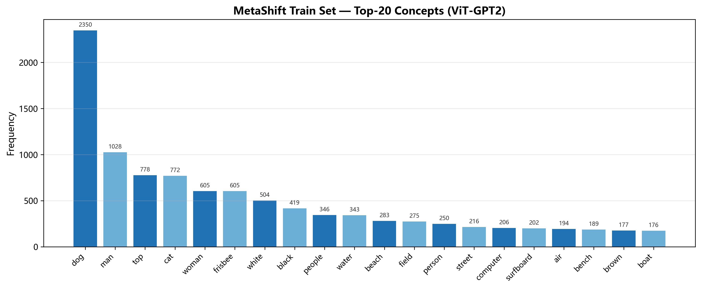
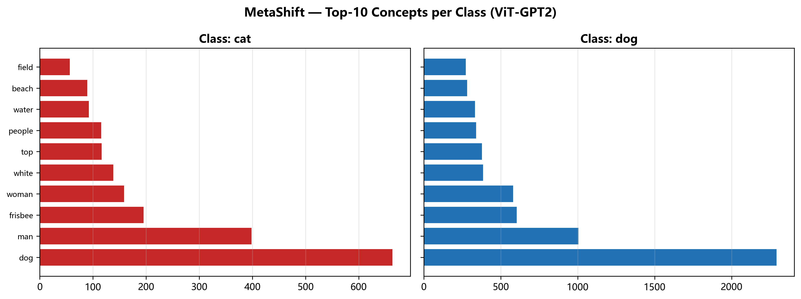

# MetaShift — ViT-GPT2 Concept Extraction Report

- **Total train samples**: 4676
- **Total tokens extracted**: 17,483
- **Unique concepts (vocabulary size)**: 364

## Top-30 Overall Concepts

| Rank | Concept | Frequency |
|------|---------|-----------|
| 1 | dog | 2,350 |
| 2 | man | 1,028 |
| 3 | top | 778 |
| 4 | cat | 772 |
| 5 | woman | 605 |
| 6 | frisbee | 605 |
| 7 | white | 504 |
| 8 | black | 419 |
| 9 | people | 346 |
| 10 | water | 343 |
| 11 | beach | 283 |
| 12 | field | 275 |
| 13 | person | 250 |
| 14 | street | 216 |
| 15 | computer | 206 |
| 16 | surfboard | 202 |
| 17 | air | 194 |
| 18 | bench | 189 |
| 19 | brown | 177 |
| 20 | boat | 176 |
| 21 | snow | 165 |
| 22 | laptop | 151 |
| 23 | mouth | 145 |
| 24 | park | 140 |
| 25 | skateboard | 138 |
| 26 | bed | 135 |
| 27 | horse | 135 |
| 28 | grass | 129 |
| 29 | desk | 124 |
| 30 | motorcycle | 122 |

## Top-15 Concepts per Class

### Class: cat
| Rank | Concept | Frequency |
|------|---------|-----------|
| 1 | cat | 664 |
| 2 | top | 399 |
| 3 | computer | 196 |
| 4 | black | 159 |
| 5 | laptop | 139 |
| 6 | white | 117 |
| 7 | desk | 116 |
| 8 | bathroom | 93 |
| 9 | sink | 90 |
| 10 | dog | 57 |
| 11 | bed | 51 |
| 12 | floor | 49 |
| 13 | toilet | 48 |
| 14 | room | 46 |
| 15 | keyboard | 44 |

### Class: dog
| Rank | Concept | Frequency |
|------|---------|-----------|
| 1 | dog | 2,293 |
| 2 | man | 1,007 |
| 3 | frisbee | 605 |
| 4 | woman | 583 |
| 5 | white | 387 |
| 6 | top | 379 |
| 7 | people | 342 |
| 8 | water | 334 |
| 9 | beach | 283 |
| 10 | field | 275 |
| 11 | black | 260 |
| 12 | person | 235 |
| 13 | street | 215 |
| 14 | surfboard | 201 |
| 15 | air | 194 |

## Top-5 Concepts per Context (first 10 contexts)

### Context: bandana
dog(23), brown(4), white(4), woman(3), frisbee(3)

### Context: basket
dog(27), woman(7), bike(7), man(6), person(5)

### Context: bear
cat(5), animal(3), bear(2), lot(2), floor(2)

### Context: blinds
cat(24), top(13), window(12), black(6), couch(5)

### Context: boat
dog(49), boat(46), water(36), top(18), man(17)

### Context: bookcase
cat(9), top(6), bookshelf(2), living(2), room(2)

### Context: bookshelf
cat(20), top(17), living(6), room(6), black(5)

### Context: boy
dog(22), man(16), woman(10), frisbee(9), boy(8)

### Context: bun
dog(12), hot(11), bun(8), mustard(5), ketchup(4)

### Context: bus
bus(10), dog(7), city(3), woman(3), black(3)

## Visualisations

## Observations

- ViT-GPT2 tends to produce short, generic captions on MetaShift images.
- Common captions: 'a dog', 'a cat', 'a black and white dog', etc.
- Breed-level concepts (bulldog, corgi, etc.) are rarely/never detected.
- Background concepts (grass, beach, snow) may appear but less frequently than BLIP.
- This limits SPUME's ability to construct fine-grained class-attribute correlations.